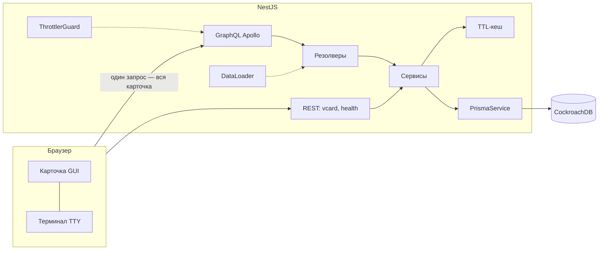

# dev-card — цифровая визитка

> NestJS · code-first GraphQL · Prisma · CockroachDB · Docker · Claude Code

Живая цифровая визитка с собственным GraphQL API. Два режима: обычная страница
и полноценный терминал (`>_ TTY`), который выполняет реальные GraphQL-запросы —
включая произвольные, через команду `gql`.

**Живая версия:** _ссылка появится после деплоя (см. [DEPLOY.md](DEPLOY.md))_
**API-эксплорер:** `/graphql` (Apollo Sandbox) · **vCard:** `/vcard.vcf`

```
guest@card:~$ help
  about      — кто я
  skills     — стек с уровнями
  gql <q>    — выполнить произвольный GraphQL-запрос
  ...
```

## Требуемые технологии → как они использованы

| Технология | Использование |
| --- | --- |
| **Git** | осмысленная история conventional commits, `.gitattributes`, ветка `main` |
| **TypeScript** | строгий режим везде: backend, тесты, frontend (без фреймворков) |
| **Node.js** | Node 22, graceful shutdown по SIGTERM, healthcheck-пробы |
| **NestJS** | модули по фичам, DI, guards, pipes, interceptors, Terminus |
| **Prisma** | схема, миграции, типобезопасные запросы, сид с сохранением пользовательских данных |
| **GraphQL** | code-first схема (`schema.gql` закоммичен), DataLoader против N+1, depth limit |
| **Docker** | multi-stage `Dockerfile` (non-root, HEALTHCHECK), `docker-compose.yml` со стеком целиком |
| **Claude Code** | инструмент разработки с ревью и тестами — см. [раздел ниже](#как-использовался-claude-code) |
| CockroachDB* | основная БД через Prisma-провайдер `cockroachdb` — как в стеке вакансии |

\* не входит в обязательный список, добавлена сознательно под стек проекта.

## Что умеет

- **Двуязычный контент (RU/EN)** — хранится в базе, локаль — аргумент GraphQL-запроса;
- **Терминальный режим** с историей команд, `gql <запрос>` гоняет настоящие запросы к API;
- **Эндорсменты навыков** — мутация с rate limiting и инвалидацией кеша;
- **Форма контакта** — валидация class-validator + лимит 3 сообщения/час на IP,
  причём лимит хранится в БД (переживает рестарты и работает при нескольких репликах);
- **Живая статистика** — просмотры, уникальные посетители (по хешам IP), аптайм;
- **vCard 4.0** — визитку можно сохранить в контакты, QR-код ведёт на `/vcard.vcf`;
- **K8s-style health-пробы** — `/health/live`, `/health/ready` (проверка БД);
- **Самовосстанавливающийся контент** — пустая база засеивается при старте.

## Архитектура



Решения, на которые стоит посмотреть:

- **`src/app.setup.ts`** — вся HTTP-обвязка (helmet CSP, CORS, pipes) одной
  функцией, используется и в `main.ts`, и в e2e: тесты гоняют боевой пайплайн;
- **`src/skills/skills.loader.ts`** — DataLoader на `Project.skills`: сколько бы
  проектов ни было, навыки резолвятся одним `WHERE name IN (...)`;
- **`src/common/ttl-cache.service.ts`** — осознанно минимальный in-process кеш
  (один инстанс, крошечный датасет). Границы сервиса такие, что замена на Redis
  не трогает вызывающий код;
- **`src/contact/contact.service.ts`** — два уровня rate limiting: in-memory
  ThrottlerGuard от бурстов + персистентный лимит в БД;
- **`formatError`** в `src/app.module.ts` — Nest-исключения превращаются в
  внятные GraphQL-коды (`NOT_FOUND`, `BAD_REQUEST` с деталями валидации),
  в проде внутренности скрыты;
- **приватность** — сырые IP не хранятся вообще, только солёный SHA-256.

## Быстрый старт

```bash
# всё сразу (приложение + CockroachDB):
docker compose up -d --build
# → http://localhost:3000

# режим разработки:
docker compose up -d db
cp .env.example .env
npm ci
npx prisma migrate dev && npx prisma db seed
npm run start:dev
```

## Примеры запросов

Вся карточка одним запросом (в этом и смысл GraphQL):

```graphql
query Card($locale: Locale!) {
  profile(locale: $locale) { fullName title summary }
  skills(featuredOnly: true) { name level endorsements }
  projects(locale: $locale) { name stack skills { name category } }
  stats { totalViews uptimeSeconds }
}
```

```graphql
mutation { endorseSkill(name: "NestJS") { name endorsements } }
```

## Тесты и CI

```bash
npm run typecheck   # строгие типы: backend + web
npm run lint        # eslint (type-aware)
npm test            # 20 юнит-тестов, без БД
npm run test:e2e    # 10 e2e против реальной CockroachDB
```

GitHub Actions (`.github/workflows/ci.yml`): lint → typecheck → unit → e2e с
поднятой CockroachDB → сборка Docker-образа.

## Как использовался Claude Code

Без вайб-кодинга. Claude Code здесь — ускоритель с жёсткими рамками:

- **[CLAUDE.md](CLAUDE.md)** фиксирует правила проекта: архитектурные границы,
  чек-лист перед коммитом, запрет `any`, работу с миграциями;
- **`.claude/commands/`** — повторяемые процедуры (`/verify`,
  `/new-field`) вместо «сгенерируй что-нибудь»;
- каждое изменение проходит типизацию, линт и тесты (см. CI) и ложится
  осмысленным коммитом; сгенерированный код читается и правится, а не
  копируется вслепую — трейлеры `Co-Authored-By: Claude` в истории честно
  показывают, где ассистент участвовал.

## Структура

```
prisma/          схема, миграции, сид
src/
  app.setup.ts   HTTP-пайплайн (общий для прода и e2e)
  common/        TTL-кеш, IP-хеширование, GraphQL-троттлер
  content/       контент карточки (данные, не код) + автосид
  <feature>/     module + resolver + service + models на фичу
web/             frontend: vanilla TS → esbuild → 39 КБ бандл
public/          статика (отдаётся тем же NestJS)
test/            e2e-сьют
```

## Лицензия

MIT
